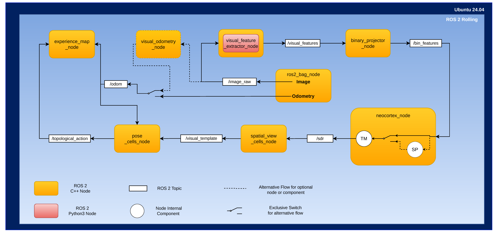

# neoslam

This package is a bio-inspired SLAM system for ROS 2 (tested on ROS 2 Rolling) that combines deep learning visual features, Hierarchical Temporal Memory (HTM), and topological mapping for robust simultaneous localization and mapping.

## System Overview



neoslam implements a complete visual SLAM pipeline with the following components:

- **Visual Feature Extractor**: Extracts deep features from camera images using AlexNet (PyTorch)
- **Binary Projector**: Reduces dimensionality using Locality-Sensitive Binary Hashing (LSBH)
- **Neocortex (HTM)**: Learns temporal sequences using Hierarchical Temporal Memory
- **Spatial View Cells**: Performs visual place recognition and loop closure detection
- **Pose Cells**: Maintains pose estimation through continuous attractor network dynamics
- **Experience Map**: Builds and maintains a topological map with iterative refinement

## Dependencies

In addition to standard ROS 2 dependencies, this package requires:

### ROS 2 Packages
- `rclcpp`
- `std_msgs`
- `sensor_msgs`
- `geometry_msgs`
- `nav_msgs`
- `visualization_msgs`
- `tf2_ros`
- `tf2_geometry_msgs`
- `cv_bridge`
- `image_transport`
- `topological_msgs` (custom package - must be installed separately)

### System Libraries
- `OpenCV` (for image processing)
- `Eigen3` (for matrix operations)
- `Boost` (serialization component for HTM)
- `Irrlicht` (optional, for 3D visualization)
- `OpenGL` (optional, for visualization)
- `PyTorch` with CUDA (for deep learning feature extraction)
- `PyBind11` (for Python-C++ integration)
- `Roaring Bitmaps` (for efficient sparse representation)

## Installation

### 1. Install System Dependencies

You can use the provided installation script:

```bash
cd ~/ros2_ws/src/neoslam
chmod +x install_dependencies.sh
./install_dependencies.sh
```

Or install manually:

```bash
sudo apt update
sudo apt install -y \
    ros-rolling-cv-bridge \
    ros-rolling-image-transport \
    ros-rolling-image-transport-plugins \
    ros-rolling-tf2-geometry-msgs \
    ros-rolling-vision-opencv \
    libopencv-dev \
    libboost-all-dev \
    libirrlicht-dev \
    libgl1-mesa-dev \
    libglu1-mesa-dev \
    libeigen3-dev \
    python3-opencv \
    python3-pip
```

### 2. Install Python Dependencies

```bash
pip3 install torch torchvision pybind11 numpy
```

### 3. Clone Required Repositories

```bash
cd ~/ros2_ws/src
git clone https://github.com/BorgesJVT/neoslam.git
git clone https://github.com/BorgesJVT/topological_msgs.git
```

### 4. Generate Random Projection Matrix

The binary projector requires a random projection matrix. Generate it with:

```bash
cd ~/ros2_ws/src/neoslam/src/dim_reduction_and_binarization/random_matrix
python3 generate_random_matrix.py --rows 64896 --cols 1024 --output randomMatrix.bin
```

### 5. Build the Workspace

```bash
cd ~/ros2_ws
source /opt/ros/rolling/setup.bash
colcon build --packages-select topological_msgs neoslam
```

### 6. Source the Workspace

```bash
source ~/ros2_ws/install/setup.bash
```

## Usage

### Basic Launch

neoslam provides launch files for different datasets:

```bash
# For iratAUS dataset
ros2 launch neoslam irataus.launch.py use_sim_time:=true

# For Robotarium dataset
# ros2 launch neoslam robotarium.launch.py use_sim_time:=true
```

### Playing Dataset Bags

In a separate terminal, play your ROS 2 bag file:

```bash
# For iratAUS dataset
ros2 bag play data/irat_aus_28112011.db3 --rate 1.0 --clock --start-paused

# Adjust rate as needed (1.0 = real-time, 2.0 = 2x speed, etc.)
```

<!-- ## Configuration

Configuration files are located in the `config/` directory:

- `config_neoslam_irataus.yaml`: Configuration for iratAUS dataset
- `config_neoslam_robotarium.yaml`: Configuration for Robotarium dataset

Key parameters include:

- **Visual Feature Extractor**: Image cropping, frame stride, AlexNet model path
- **Binary Projector**: Random matrix path, LSBH parameters
- **Neocortex (HTM)**: Temporal memory parameters (columns, cells, thresholds)
- **Spatial View Cells**: Loop closure thresholds, interval parameters
- **Pose Cells**: Network dimensions, attractor dynamics parameters
- **Experience Map**: Relaxation parameters, map correction rates -->
